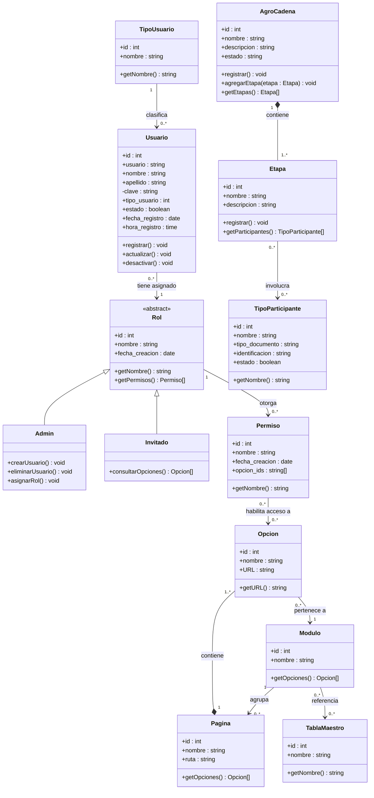

# Diagrama de Clases UML — Evergreen · Módulo ADM

## Leyenda de relaciones

| Símbolo | Tipo | Lectura |
|---|---|---|
| `<\|--` | Herencia (generalización) | "es un tipo de" |
| `"1" *-- "1..*"` | Composición | El hijo no puede existir sin el padre |
| `"1" --> "0..*"` | Asociación | Una instancia se relaciona con cero o más |
| `"0..*" --> "0..*"` | Asociación muchos a muchos | Varias instancias se relacionan entre sí |

## Multiplicidades utilizadas

| Notación | Significado |
|---|---|
| `1` | Exactamente uno |
| `0..*` | Cero o muchos |
| `1..*` | Uno o muchos (al menos uno) |

## Notas de diseño

- **`Rol`** es abstracta — no se instancia directamente, solo a través de `Admin` o `Invitado`.
- **`Permiso`** media el acceso a `Opcion`: un Invitado llega a las opciones *a través* de los permisos que tenga asignados su rol, no directamente.
- **`Permiso`** media el acceso a `Opcion`: un Invitado llega a las opciones *a través* de los permisos que tenga asignados su rol, no directamente.
- **`Permiso.opcion_ids`** modela en la implementación la lista de opciones habilitadas por permiso.
- **`Modulo`** agrupa `Pagina` en la implementación (`pagina.modulo_id`) y cada `Opcion` queda asociada al módulo de su página.
- **`clave`** en `Usuario` tiene visibilidad privada (`-`) — no se expone en consultas ni en la UI.
- **`Etapa`** tiene composición con `AgroCadena` — si se elimina la cadena, sus etapas desaparecen.
- **`Opcion`** tiene composición con `Pagina` — una opción no existe fuera de su página.
- **`TablaMaestro`** agrupa los catálogos del sistema: TipoUsuario, TipoParticipante, TipoProyección, TipoReporte.
