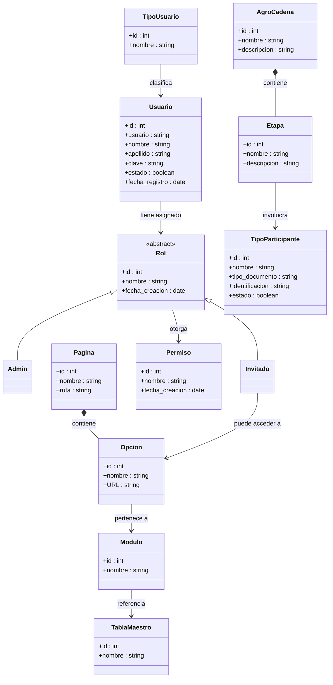

# Modelo de Dominio — Evergreen · Módulo ADM

## Leyenda

| Símbolo | Tipo | Significado |
|---|---|---|
| `*--` | Composición | El hijo no existe sin el padre |
| `<\|--` | Herencia | El hijo es un tipo del padre |
| `-->` | Asociación | Una entidad conoce / referencia a otra |

## Módulos del sistema

| Módulo | Entidades principales |
|---|---|
| **Gestión de Usuarios** | TipoUsuario, Usuario |
| **Control de Acceso** | Rol, Admin, Invitado, Permiso |
| **Navegación** | Pagina, Opcion, Modulo |
| **AgroCadena** | AgroCadena, Etapa, TipoParticipante |
| **Tablas Maestro** | TablaMaestro, TipoProyeccion, TipoReporte |
