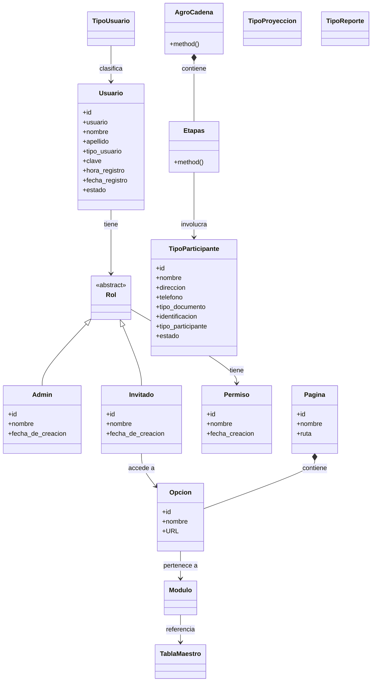

# Modelo de Dominio — Evergreen

## Leyenda

| Símbolo | Tipo | Significado |
|---|---|---|
| `*--` | Composición | El hijo no existe sin el padre |
| `<\|--` | Herencia | El hijo es un tipo del padre |
| `-->` | Asociación | Una entidad conoce/referencia a otra |
